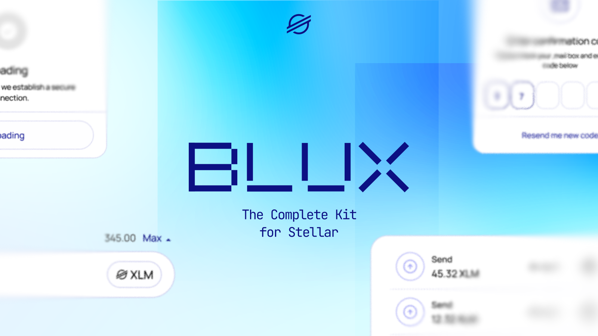

# Blux ⎯ Wallet infrastructure 
Blux is a comprehensive authentication and wallet connect kit designed for Stellar dApps. It simplifies onboarding by integrating multiple authentication methods, including wallets, email, phone, and OAuth. With Blux, developers can create seamless multi-auth experiences without the complexity of building custom authentication solutions from scratch.

## Features

- Multi-Wallet Support: Easily integrate Stellar wallets such as Rabet, xBull, Lobstr, Freighter, and Albedo.
- OAuth & Social Login (Coming Soon): Support for Apple, Meta, Google, and more.
- Email & Phone Authentication (Coming Soon): Securely onboard users with non-crypto credentials.
- Customizable UI: Adjust themes, fonts, backgrounds, logos, corner radius, and text colors.
- Configurable Networks: Set up and modify network preferences via API keys.
- Future-Proof: More wallets and authentication methods will be added based on community feedback.
